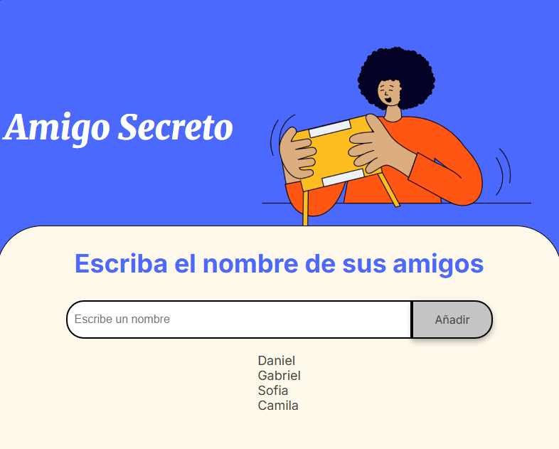
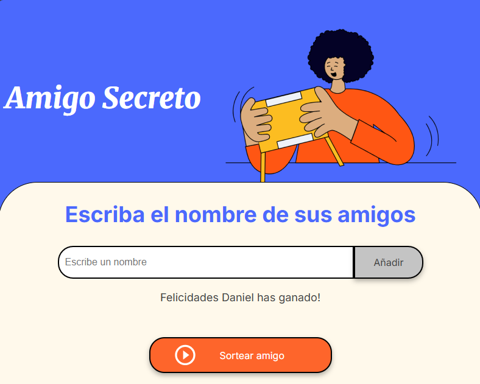

# 🎁 Amigo Secreto

Aplicación web simple e interactiva para organizar un **sorteo de amigo secreto** entre amigos.  
Permite añadir nombres, mostrarlos en pantalla y elegir aleatoriamente al ganador.

## 🚀 Características

- Añadir nombres de amigos manualmente desde el input.
- Soporte para agregar presionando **Enter** o con el botón **Añadir**.
- Lista visible de todos los participantes.
- Función de **sorteo aleatorio** para elegir un ganador.
- Interfaz amigable y responsiva.

## 🖼 Vista previa


## ⚙️ Cómo usarlo

1. Clona este repositorio:
   ```bash
   git clone https://github.com/tu-usuario/amigo-secreto.git

2. Abre el archivo index.html en tu navegador.
3. Escribe los nombres de tus amigos y añádelos.
   


4. Pulsa Sortear amigo para elegir un ganador al azar.




📜 Lógica principal

Agregar nombres:
Se almacenan en un array nombres[] y se muestran en una lista.

Sorteo:
Se selecciona un índice aleatorio dentro del array y se muestra el ganador.

💻 Tecnologías utilizadas
HTML5 – estructura de la aplicación.

CSS3 – estilos y diseño responsivo.

JavaScript – lógica y manejo de eventos.

📄 Licencia
Este proyecto está bajo la licencia MIT.

   
